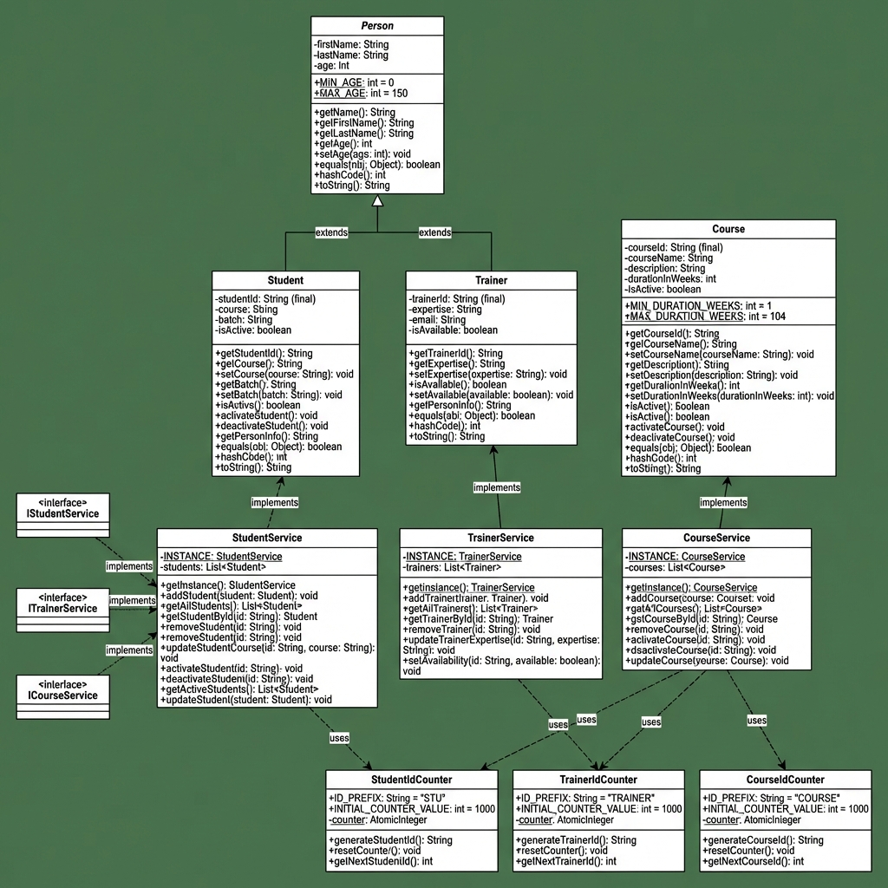

# LearnTrack Management System

A Java-based learning management system for managing students, trainers, and courses. Built with object-oriented programming principles, comprehensive error handling, and thread-safe services.

## Table of Contents

- [Features](#features)
- [Class Diagram](#class-diagram)
- [Prerequisites](#prerequisites)
- [How to Compile and Run](#how-to-compile-and-run)


## Features

### Student Management

- Add new students with auto-generated unique IDs
- View all students or search by ID
- Update student course and batch information
- Remove students from the system
- Track student active status

### Trainer Management

- Register trainers with expertise areas
- Update trainer expertise and availability
- View all trainers or retrieve by ID
- Manage trainer availability status
- Email validation for trainers

### Course Management

- Create courses with auto-generated IDs
- View all courses or search by ID
- Deactivate/activate courses
- Update course details (name, description, duration)
- Validate course duration (1-104 weeks)

## Class Diagram

The following UML class diagram shows the relationships between all classes in the LearnTrack system:



### Key Relationships

- **Inheritance**: `Student` and `Trainer` both extend the abstract `Person` class
- **Service Pattern**: Each service (`StudentService`, `TrainerService`, `CourseService`) implements the Singleton pattern and manages a collection of entities
- **ID Generation**: Utility classes (`StudentIdCounter`, `TrainerIdCounter`, `CourseIdCounter`) use static methods and `AtomicInteger` for thread-safe ID generation
- **Interface Implementation**: Services implement corresponding interfaces (`IStudentService`, `ITrainerService`, `ICourseService`) for loose coupling

## Prerequisites

- **Java Development Kit (JDK)**: Version 8 or higher
- **Terminal/Command Prompt**: For compilation and execution

## How to Compile and Run


### Step 1. Clone or Download the Project


### Step 2: Compile the Project

From the project root directory, compile all Java source files:
```
# Compile all Java files from the src directory into bin
javac src/com/airtribe/learntrack/ui/Main.java
```

### Step 3: Run the Application
# Run the Main class from the bin directory
```
java -cp bin src.com.airtribe.learntrack.ui.Main
```

**Alternative**: If you're already in the `bin` directory:

```bash
cd bin
java src.com.airtribe.learntrack.ui.Main
```
